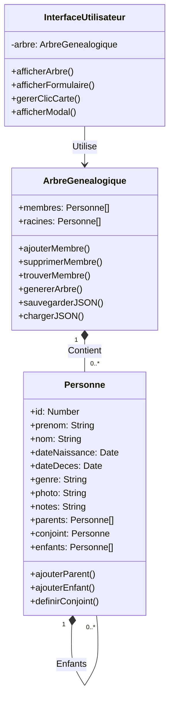

# 🌳 Arbre Généalogique - Projet Scolaire

*Application web développée en JavaScript pour le cours de Recherche Opérationnelle*

---

## 📌 Table des Matières
- [Description](#-description)
- [Fonctionnalités](#-fonctionnalités)
- [Technologies](#-technologies)
- [Installation](#-installation)
- [Utilisation](#-utilisation)
- [Structure du Projet](#-structure-du-projet)
- [Aperçu](#-aperçu)
- [Auteurs](#-auteurs)

---

## 📝 Description
Application web permettant de **créer et visualiser** un arbre généalogique complet avec :
- Gestion des relations familiales (parents/enfants/conjoints)
- Système de sauvegarde/chargement
- Interface intuitive et responsive

**Contexte** : Projet réalisé dans le cadre du cours de Recherche Opérationnelle.

---

## 🎯 Fonctionnalités
### 🌟 Principales
- ✅ Visualisation hiérarchique de la famille
- ✅ Ajout/modification/suppression des membres
- ✅ Gestion des relations complexes
- ✅ Export/import au format JSON

### ✨ Bonus
- 🎨 Design coloré par genre
- 📱 Compatible mobile
- ➕ Ajout rapide d'enfants

---

## 💻 Technologies

### Classes UML pour ce système d'arbre généalogique

